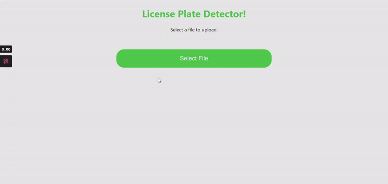

FGR Custom Vision License Plate Detector BACKEND
---

This is the backend API for the FGR Custom Vision License Plate Detector. It showcases some of my experience with Computer Vision. Specificlly in the relam of Object Detection dn Object Localization. I utilize the [YOLOv4](https://arxiv.org/abs/2004.10934v1) Object Detection Algorithm.

Learn More
---
Learn More about my FGR Custom Vision License Plate Detector [here](https://frankieriviera.com/portfolio/custom-vision)

<!-- When pulling down from github either build the docker container or pull the docker image. the docker image will have the model already and the DOCKERFILE knows to pull weights and build container (I could use secrets to help build decide what model to make? or just use mutiple dockerfiles.) -->
Example
---


Run With Docker
---

1. Pull image `docker pull dariv94/license_plate_detector:2.0` This will take some time since the dependancies to run tensorflow, opencv-python and numpy are large.
2. Run Container `docker run --rm -p 5000:5000 dariv94/license_plate_detector:2.0`
3. This may take a minute or two to get up a running, but then you should be apply to make a request as follows

    
| method |   endpoint   |   body   |
|---------------------|----------|----------|
| POST        | http://localhost:5000/image       | Form Data: images + YourImage.png/.jpeg/.jpg/.bmp      |

<!-- Local Run


1. Install Python 3.8 you can find a python 3.8 version [here](https://www.python.org/downloads/)

2. Create virtual envionment
`python -m venv venv`

2. Activate virtual envionment

    *Windows*
`./venv/Scripts/activate`

    *Linux/Mac*
`source venv/bin/activate`

4. install dependancies `pip install -r requirments`

5. download custom object detection weights file
    
| Object Detector Model |   weights file name   |   download link   |
|---------------------|----------|----------|
| License Plates        | license_plate.weights       | [download](https://onedrive.live.com/download?cid=4096C8A9EB1D4246&resid=4096C8A9EB1D4246%211338032&authkey=AAj07WGHXhheDKQ)      |

6. Convert .weights file into [tensorflow savedmodel format ](https://www.tensorflow.org/guide/saved_model)
Ex:
`RUN python save_model.py --weights ./license_plate.weights --output ./models/license_plate-416 --input_size 416 --model yolov4 `

7. Then run the project `python app.py`
You should now have able to send a request http://localhost:5000/image

Example using Curl:
*Windows uses curl.exe, for linux and mac just use curl*
```
curl.exe -X POST -F images=@your/path/to/your/car.jpg "http://localhost:5000/image" --output test.png
``` -->
[](https://frankieriviera.com)

This is an FGR project. 

To see some more of my projects you can go to [FrankieRiviera.com](https://frankieriviera.com)